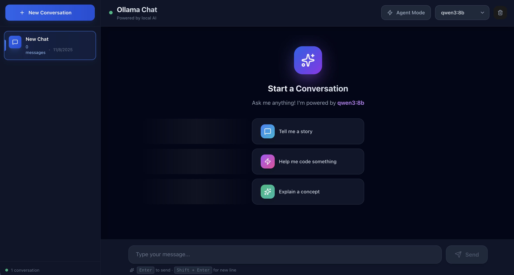
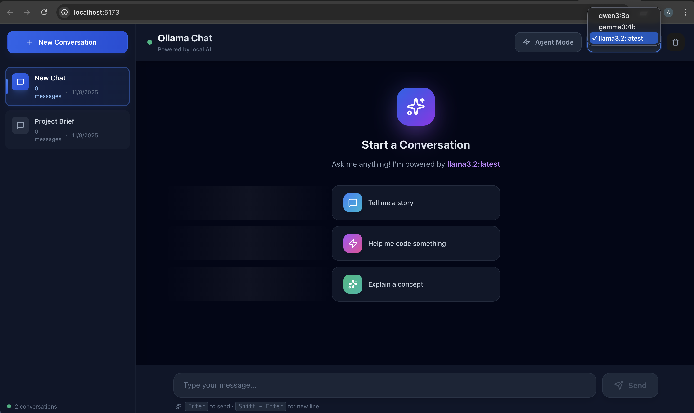
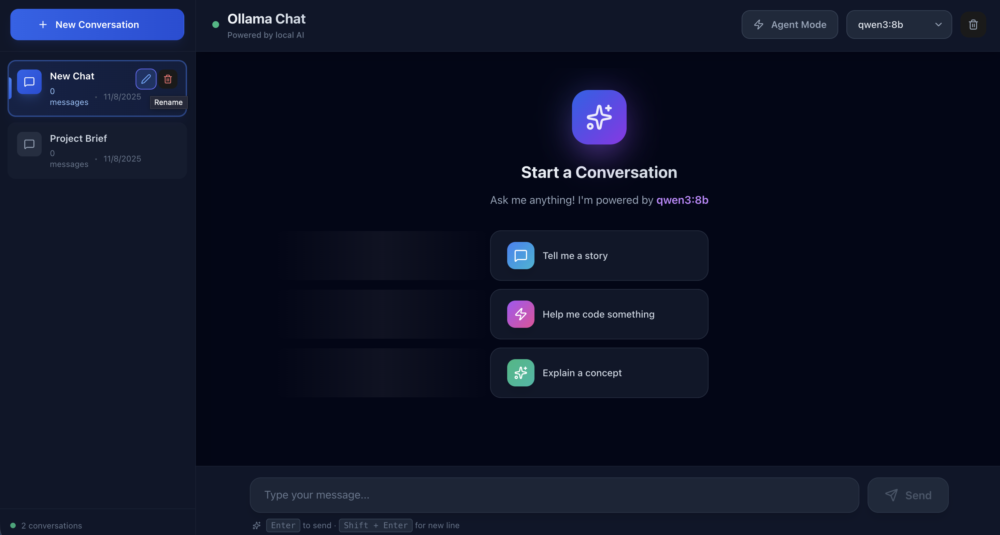
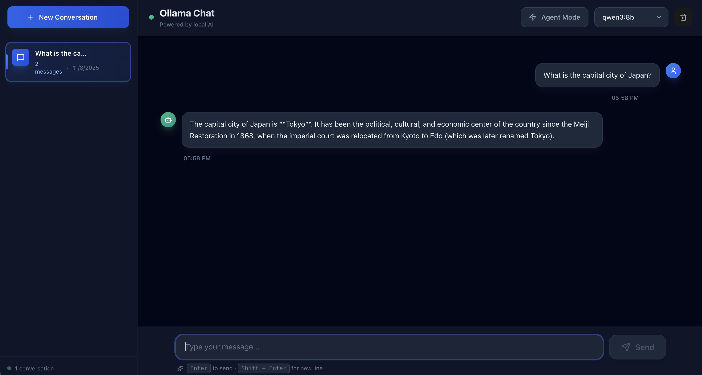
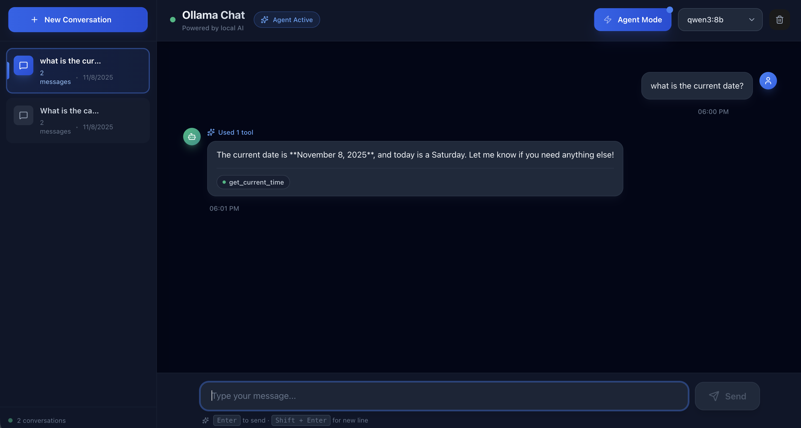

# 3997-chatbot-ollama

A local-first application providing a modern, responsive web interface for interacting with a local Ollama instance
using a FastAPI streaming backend and a React/TypeScript frontend.

## Prerequisites

You must have Ollama installed and running on your system.

### Running Ollama

1. **Download & Install:** Follow the instructions on the [Ollama website](https://ollama.com/) to install the software.

2. **Download a Model:** Before running the application, ensure you have a model downloaded (e.g., `gemma3:1b`):

```
ollama pull gemma3:1b
```

3. **Verify:** Ollama should be running on the default address: `http://localhost:11434`.

## 1. Python Backend Setup

The backend handles communication with the Ollama API, streaming responses to the frontend.

1. **Navigate to the root directory:**

```
cd 3997-chatbot-ollama
```

2. **Setup Environment and Install Dependencies:** We use `pyproject.toml` for dependency management and `uv` to manage
   the environment.

```
make install
```

*(This runs `uv sync --all-groups` to install all necessary packages.)*

3. **Run the Server:** The server will run on port 8000 with hot-reload enabled.

```
make run
```

*(This runs `uvicorn src.server:app --reload`.)*

The streaming endpoint will be available at `http://localhost:8000/api/chat`.

## 2. React Frontend Setup

The frontend is a standard Vite/TypeScript application. **All commands below should be run from the project root
directory.**

1. **Install Dependencies:** (assuming Node/npm is set up)

```
make install-client
```

*(This runs `npm --prefix client install`.)*

2. **Start the Frontend:** The frontend typically runs on port 5173 or 3000.

```
make run-client
```

*(This runs `npm --prefix client run dev`.)*

You should now be able to open the URL provided by the frontend server in your browser to interact with the Chatbot UI.

## Code Quality & Operations

We use Ruff for high-performance linting and formatting, configured via `ruff.toml`.

### Linting and Formatting

| Action     | Command       | Description                                      |
|------------|---------------|--------------------------------------------------|
| **Lint**   | `make lint`   | Checks code for errors (no fixes applied).       |
| **Format** | `make format` | Checks and automatically fixes code.             |
| **Clean**  | `make clean`  | Removes the virtual environment and built files. |

## Testing

### Frontend (Playwright)

1. Install dependencies and browsers:
   ```bash
   npm --prefix client install
   npx --prefix client playwright install
   ```
2. Run the suite (spins up Vite automatically):
   ```bash
   npm --prefix client run test:e2e
   ```
The tests mock backend endpoints so they run without Ollama or the FastAPI server.

### Backend (pytest)

1. Ensure the Python environment is synced (`make install`).
2. Execute:
   ```bash
   uv run pytest
   ```
These tests mount the FastAPI app in-process using `httpx.ASGITransport` and stub external Ollama calls.  
Coverage reports are emitted automatically to the terminal and as `reports/coverage.xml` (JUnit-compatible).

For the full QA matrix, coverage targets, and expected outputs, see [`docs/testing.md`](docs/testing.md).

## Visual Preview

| Screenshot | Description |
|-----------|-------------|
|  | Initial view with empty state. |
|  | Model dropdown, agent toggle, and status indicator. |
|  | Multi-conversation sidebar with rename/delete actions. |
|  | Streaming conversation in simple mode showing incremental responses. |
|  | Agent mode in action with tool call/results indicator. |

🎥 **Walkthrough Video:** [`resources/videos/chat-walkthrough.mov`](resources/videos/chat-walkthrough.mov)  
Shows conversation creation, streaming responses, and agent tooling in a single flow.

## Architecture Overview

For detailed C4-style diagrams (context, container, component) see [`docs/architecture.md`](docs/architecture.md).

### System Design

The application follows a clean separation of concerns with three main components:

**Backend (FastAPI)**

- Location: `src/server.py` and `src/agent/`
- Handles Ollama API communication
- Implements agent orchestration with LangGraph
- Supports tool calling (web search, calculator, etc.)
- Streams responses in real-time via Server-Sent Events

**Frontend (React + TypeScript)**

- Location: `client/src/`
- Modern component-based architecture
- Real-time streaming UI with smooth animations
- Multi-conversation support with persistent state
- Professional design with Tailwind CSS

**Agent System (LangGraph)**

- Location: `src/agent/`
- State-based workflow management
- Tool execution and result streaming
- Multi-step reasoning capabilities
- Graceful error handling and fallbacks

### Key Features

**Streaming Protocol:** Asynchronous streaming responses with real-time tool execution visibility

**Fallback Strategy:** Automatic fallback from modern `/api/chat` to legacy `/api/generate` endpoint for older Ollama
versions

**Agent Modes:**

- **Simple Mode:** Direct LLM responses via ollama (fast)
- **Agent Mode:** Enables AI to use tools for enhanced capabilities like 
calculations, and current information, etc. Takes longer but provides more accurate, 
real-time results.
⚠️ **Note:** Only certain models support tool calling (e.g., qwen3, deepseek, 
llama3.1). If your selected model doesn't support Agent Mode, you'll see an error 
message in the UI. 
- For quick responses, keep Agent Mode off.

**Multi-Conversation:** Manage multiple chat sessions with sidebar navigation and session persistence

### Using the Prompts

As required in the task, this project was built using main prompts, attached in the
prompts folder.
See `prompts/README.md` for detailed development workflow.

### Tech Stack

**Backend:** Python 3.10+, FastAPI, LangChain, LangGraph, Ollama  
**Frontend:** React 18, TypeScript, Vite, Tailwind CSS  
**Tools:** Ruff (linting), Make (automation), UV (dependency management)
