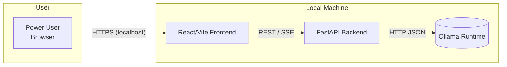
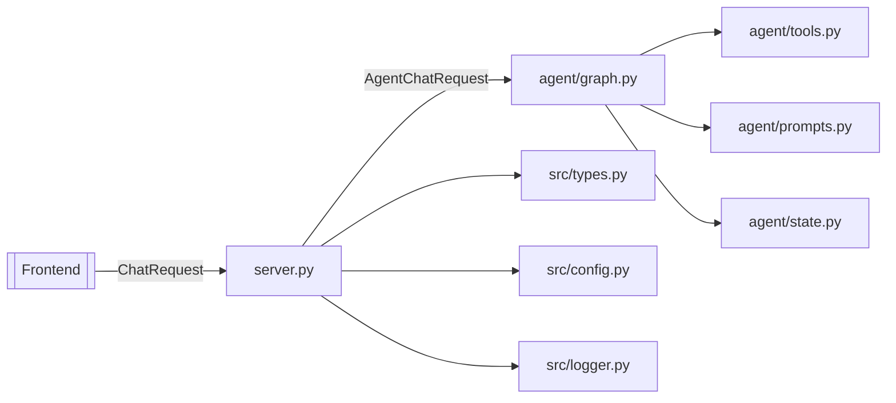

# Architecture Overview

This document captures the core architectural views for the 3997 Chatbot Ollama project using a lightweight C4-style breakdown. Diagrams are provided as Mermaid definitions so they stay versionable alongside the source.

---

## C1 — System Context



**Key points**
- Entire flow runs on the user’s workstation; no external services are contacted.
- The backend is responsible for brokering requests to the Ollama runtime and exposing higher-level agent functionality.

---

## C2 — Container View

```mermaid
graph TB
    subgraph Browser
        FE[React App\n(Vite + Tailwind)]
    end

    subgraph Backend
        FastAPI[FastAPI Server\nuvicorn]
        LangGraph[LangGraph Agent Graph]
        Tools[Tooling Layer\n(search, calculator, etc.)]
    end

    subgraph Runtime
        OllamaRT[(Ollama Daemon)]
    end

    FE -->|"GET /api/models"| FastAPI
    FE -->|"POST /api/chat"| FastAPI
    FE -->|"POST /api/agent/chat"| FastAPI
    FastAPI -->|Invoke| LangGraph
    LangGraph -->|Tool calls| Tools
    FastAPI -->|JSON streaming| FE
    FastAPI -->|/api/chat proxy| OllamaRT
```

**Responsibilities**
- **Frontend**: conversation management, model selection, rendering streaming/tool events.
- **FastAPI**: health/routes, request validation, logging, streaming SSE responses.
- **LangGraph container**: orchestrates agent state machine and tool execution.
- **Ollama runtime**: provides model inference for both simple chat and agent calls.

---

## C3 — Backend Component View



**Component responsibilities**
- `server.py`: FastAPI app definition, SSE stream generators, routing.
- `agent/graph.py`: LangGraph state machine for agent mode plus simple graph fallback.
- `agent/tools.py`: Tool registry used during agent execution.
- `agent/prompts.py`: System prompt templates (Jinja2) for agent persona.
- `types.py`: Pydantic request/response models.
- `config.py`: Centralized feature flags (e.g., agent toggle) and constants.
- `logger.py`: Structured logging setup shared across modules.

---

## Operational Flow (Simple vs Agent)

| Step | Simple Mode (`/api/chat`) | Agent Mode (`/api/agent/chat`) |
|------|--------------------------|--------------------------------|
| 1 | Frontend posts user message + model. | Frontend posts message, model, `tool_choice`. |
| 2 | FastAPI streams directly to Ollama `/api/chat`. | FastAPI builds LangChain messages and initializes agent graph. |
| 3 | Ollama streams chunks → forwarded verbatim. | Agent graph emits status/tool_call/tool_result events via `astream`. |
| 4 | Frontend renders assistant text as SSE lines arrive. | FastAPI emits final message once agent finishes (or fallback `invoke`). |

---

## Deployment & Ops Notes

- All components are started locally (`make run`, `npm --prefix client run dev`); production deployment would run FastAPI under uvicorn/gunicorn and serve the built frontend statically.
- Observability is provided via structured logs (`LOGGER`) and Playwright/pytest report artifacts.
- Security boundary is the local machine; secrets are not required, but `.env` support can be layered via `config.py`.

---

Maintainers should update this document whenever a new container/component is added (e.g., external vector DB, cloud function) to keep architectural knowledge current.
